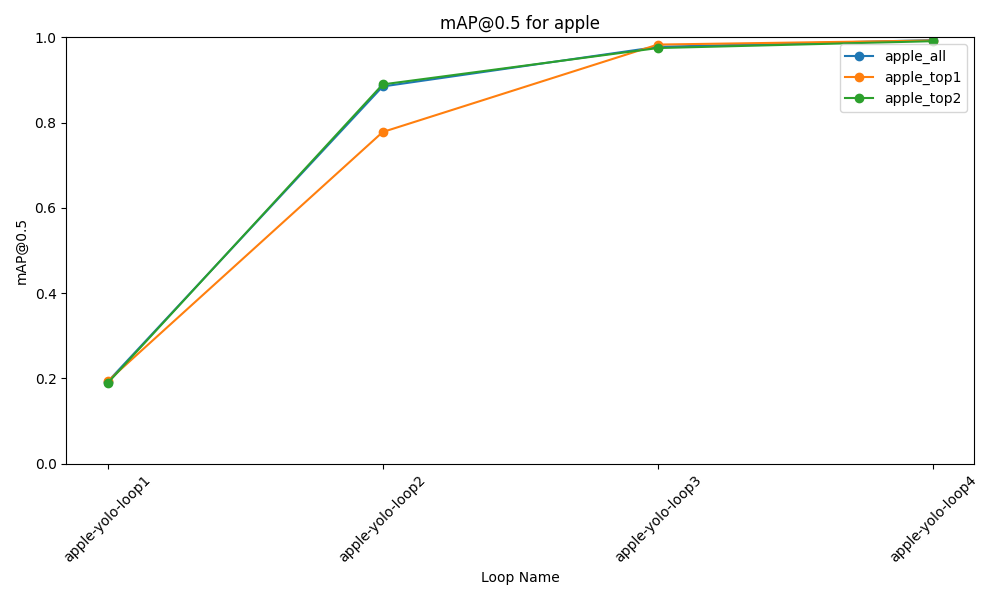
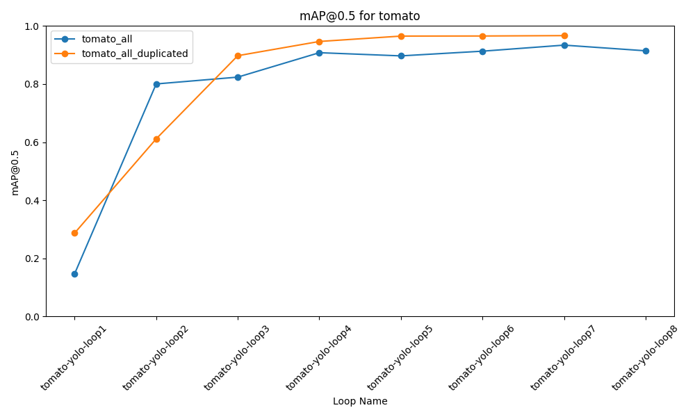
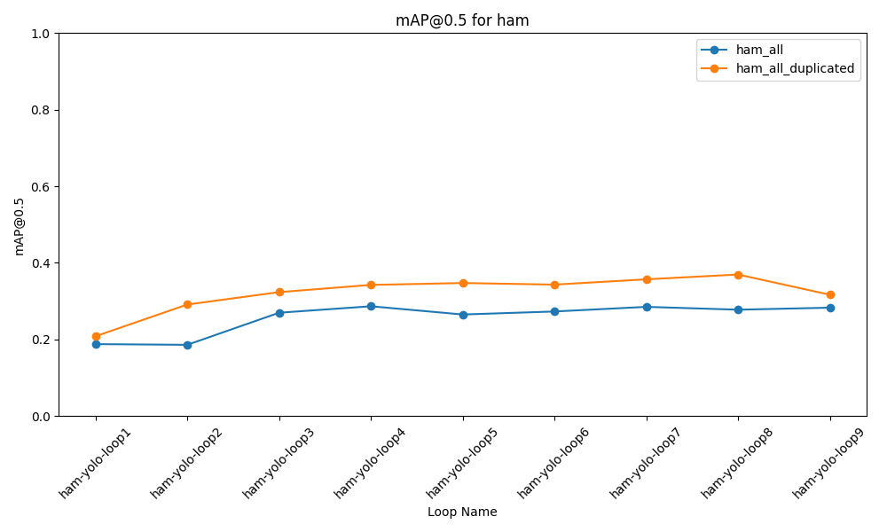
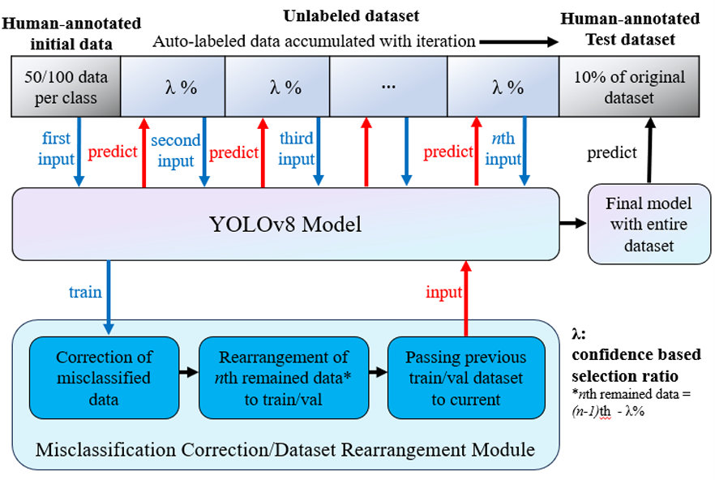
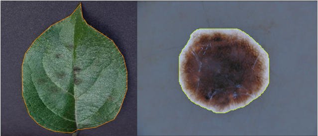
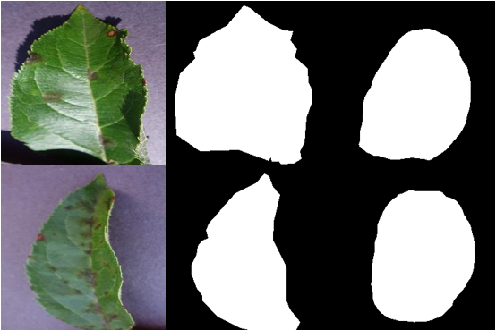

# YOLOv8-ADL_Renewed
This is renewed version of YOLOv8-ADL with additional experiment settings and the transformer model.  

This repository contains the code for the paper that will be published:  
**IEEE ICMLA 2023, publication in an edited book tentatively titled “Deep Learning Applications”, 2024 (Upcoming)**  

Which is the extension of the former research from ICMLA 2023 conference:  
**Automated Data Labeling for Object Detection viaIterative Instance Segmentation**  
**Repository of the original(former) research:**  
https://github.com/jinyoonok2/YOLOv8-ADL/tree/main

The new title for the book chapter is:  
**Automated image data segmentation via self-iterative training**

The paper draft will be posted both on the personal webpage and repository soon.

Due to the large volume of the dataset and runs information, they are not posted here together.

Dataset used the parts of the PlantVillage dataset and HAM10000 dataset.

The runs information of the models that were used in the experiment can be downloaded from the below link:  
https://pennstateoffice365-my.sharepoint.com/:f:/g/personal/juk481_psu_edu/Enr6RsMb5NlOrM0RKEF5u28BGMSV--9KZBbgKPemkjYnUw?e=ehqBGv

# Images from the added experiments

